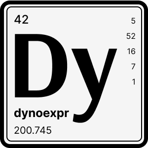

<br />
<div align="center">
  

  <h1 align="center">dynoexpr</h3>

  <p align="center">
    Expression builder for <i>AWS.DynamoDB.DocumentClient</i>
  </p>
  <p align="center">
  	
  	<a href="https://codeclimate.com/github/tuplo/dynoexpr/test_coverage">
    
  	</a>
  </p>

</div>

## Introduction

Converts a plain object to a DynamoDB expression with all variables and names
replaced with safe placeholders. It supports `Condition`, `KeyCondition`, `Filter`, `Projection` and `Update` expressions. The resulting expressions can then be used with `AWS.DynamoDB.DocumentClient` requests.

```typescript
import dynoexpr from '@tuplo/dynoexpr';

const params = dynoexpr({
  KeyCondition: { id: '567' },
  Condition: { rating: '> 4.5' },
  Filter: { color: 'blue' },
  Projection: ['weight', 'size'],
});

/*
{
  KeyConditionExpression: '(#n75a60c8f = :v64c5aa3d)',
  ExpressionAttributeValues: { 
    ':v64c5aa3d': '567', 
    ':va7bbf170': 4.5, 
    ':v91380c8f': 'blue'
  },
  ConditionExpression: '(#n8793843d > :va7bbf170)',
  FilterExpression: '(#n4bce9bfd = :v91380c8f)',
  ProjectionExpression: '#nf337db8f,#n395c1a24',
  ExpressionAttributeNames: {
    '#n75a60c8f': 'id',
    '#n8793843d': 'rating',
    '#n4bce9bfd': 'color',
    '#nf337db8f': 'weight',
    '#n395c1a24': 'size'
  }
}
*/
```

## Install

```bash
$ npm install @tuplo/dynoexpr

# or with yarn
$ yarn add @tuplo/dynoexpr
```

## Usage

### Passing parameters to DocumentClient

```typescript
const docClient = new AWS.DynamoDB.DocumentClient();

const params = dynoexpr({
  KeyCondition: {
    HashKey: 'key',
    RangeKey: 'between 2015 and 2019',
  },
});

const results = await docClient
  .query({ TableName: 'table', ...params })
  .promise();
```

### Using multiple expressions on the same field

You can use multiple expressions on the same field, by packing them into an array and assigning it to the key with the field's name.

```typescript
const params = dynoexpr({
  Condition: {
    color: ['attribute_not_exists', 'yellow', 'blue'],
  },
  ConditionLogicalOperator: 'OR',
});

/*
{
  ConditionExpression: '(attribute_not_exists(#n4bce9bfd)) OR (#n4bce9bfd = :vaeafa351) OR (#n4bce9bfd = :v91380c8f)',
  ExpressionAttributeNames: { 
    '#n4bce9bfd': 'color'
  },
  ExpressionAttributeValues: {
    ':vaeafa351': 'yellow', 
    ':v91380c8f': 'blue'
  }
}
*/
```

### Using functions

`DynamoDB` supports a number of [functions](https://docs.aws.amazon.com/amazondynamodb/latest/developerguide/Expressions.OperatorsAndFunctions.html#Expressions.OperatorsAndFunctions.Functions) to be evaluated when parsing expressions. You don't need to reference the `path` argument because that's identified by the object's key.

```typescript
const params = dynoexpr({
  Condition: {
    docs: 'attribute_exists',
    brand: 'attribute_not_exists',
    extra: 'attribute_type(NULL)',
    color: 'begins_with dark',
    address: 'contains(Seattle)',
    description: 'size < 20',
  },
});

/*
{
  ConditionExpression: '(attribute_exists(#n3f51d286)) AND (attribute_not_exists(#n51fd0ed7)) AND (attribute_type(#n12a7a4d6,:v0824ec29)) AND (begins_with(#n4bce9bfd,:v372ebe37)) AND (contains(#n9ad2536a,:vb3b07bff)) AND (size(#n8fcb2786) < :v106a3b84)',
  ExpressionAttributeNames: {
    '#n3f51d286': 'docs',
    '#n51fd0ed7': 'brand',
    '#n12a7a4d6': 'extra',
    '#n4bce9bfd': 'color',
    '#n9ad2536a': 'address',
    '#n8fcb2786': 'description'
  },
  ExpressionAttributeValues: {
    ':v0824ec29': 'NULL',
    ':v372ebe37': 'dark',
    ':vb3b07bff': 'Seattle',
    ':v106a3b84': 20
    }
  }
}
*/
```

### Using multiple expressions on the same request

```typescript
const params = dynoexpr({
  Update: { Sum: 'Sum + 20' },
  Condition: { Sum: `< 100` },
});

/*
{
  ConditionExpression: '(#n0a01a3d5 < :ve770c6dd)',
  ExpressionAttributeNames: { 
    '#n0a01a3d5': 'Sum' 
  },
  ExpressionAttributeValues: { 
    ':ve770c6dd': 100, 
    ':v106a3b84': 20
  },
  UpdateExpression: 'SET #n0a01a3d5 = #n0a01a3d5 + :v106a3b84'
}
*/
```

### Working with Sets

If a value is provided as a Set, it will be converted to `DocumentClient.DynamoDbSet`. But `dynoexpr` doesn't include `DocumentClient` so you need to provide it.

```typescript
import { DocumentClient } from "aws-sdk/clients/dynamodb";

const params = dynoexpr({
  DocumentClient,
  Update: {
    Color: new Set(['Orange', 'Purple'])
  },
})

/*
{
  UpdateExpression: 'SET #ndc9f7295 = :v3add0a80',
  ExpressionAttributeNames: { 
    '#ndc9f7295': 'Color'
  },
  ExpressionAttributeValues: {
    ':v3add0a80': Set { wrapperName: 'Set', values: [Array], type: 'String' }
  }
}
*/
```

#### When using UpdateAdd or UpdateDelete, arrays are converted to DynamoDbSet

```typescript
import { DocumentClient } from "aws-sdk/clients/dynamodb";

const params = dynoexpr({
  DocumentClient,
  UpdateAdd: {
    Color: ['Orange', 'Purple']
  }
})

/*
{
  UpdateExpression: 'ADD #ndc9f7295 :v3add0a80',
  ExpressionAttributeNames: { 
    '#ndc9f7295': 'Color'
  },
  ExpressionAttributeValues: {
    ':v3add0a80': Set { wrapperName: 'Set', values: [Array], type: 'String' }
  }
}
*/
```

### Keep existing Expressions, AttributeNames and AttributeValues

```typescript
const params = dynoexpr({
  Filter: { color: 'blue' },
  ProjectionExpression: '#year',
  ExpressionAttributeNames: {
    '#year': 'year',
  },
});

/*
{
  ProjectionExpression: '#year',
  ExpressionAttributeNames: {
    '#year': 'year',
    '#n4bce9bfd': 'color'
  },
  FilterExpression: '(#n4bce9bfd = :v91380c8f)',
  ExpressionAttributeValues: {
    ':v91380c8f': 'blue'
  }
}
*/
```

### Parsing atomic requests, only expressions will be replaced

You can pass the whole request parameters to `dynoexpr` - only the expression builders will be replaced.

```typescript
const params = dynoexpr({
  TableName: 'Table',
  Key: { HashKey: 'key' },
  ReturnConsumedCapacity: 'TOTAL',
  KeyCondition: {
    color: 'begins_with dark',
  },
});

/*
{
  TableName: 'Table',
  Key: { HashKey: 'key' },
  ReturnConsumedCapacity: 'TOTAL',
  KeyConditionExpression: '(begins_with(#n4bce9bfd,:v372ebe37))',
  ExpressionAttributeNames: {
    '#n4bce9bfd': 'color'
  },
  ExpressionAttributeValues: {
    ':v372ebe37': 'dark'
  }
}
*/
```

### Parsing Batch requests

```typescript
const params = dynoexpr({
  RequestItems: {
    'Table-1': {
      Keys: [{ foo: 'bar' }],
      Projection: ['a', 'b'],
    },
  },
  ReturnConsumedCapacity: 'TOTAL',
});

/*
{
  "RequestItems":{
    "Table-1":{
      "Keys": [{"foo":"bar"}],
      "ProjectionExpression": "#n69772661,#n7531578f",
      "ExpressionAttributeNames":{
        "#n69772661": "a",
        "#n7531578f": "b"
      }
    }
  },
  "ReturnConsumedCapacity": "TOTAL"
}
*/
```

### Parsing Transact requests

```typescript
const params = dynoexpr({
  TransactItems: [{
    Get: {
      TableName: 'Table-1',
      Key: { id: 'foo' },
      Projection: ['a', 'b'],
    },
  }],
  ReturnConsumedCapacity: 'INDEXES',
});

/*
{
  "TransactItems": [
    { 
      "Get": {
        "TableName": "Table-1",
        "Key": { "id": "foo" },
        "ProjectionExpression": "#n69772661,#n7531578f",
        "ExpressionAttributeNames": {
          "#n69772661":"a",
          "#n7531578f":"b"
        }
      }
    }
  ],
  "ReturnConsumedCapacity": "INDEXES"
}
*/
```

### Type the resulting parameters

The resulting object is compatible with all `DocumentClient` requests, but if you want to be type-safe, `dynoexpr` accepts a generic type to be applied to the return value.

```typescript
const params = dynoexpr<AWS.DocumentClient.UpdateItemInput>({
  TableName: 'Table',
  Key: 1,
  UpdateSet: { color: 'pink' },
});
```

## API

### dynoexpr&lt;T&gt;(params)

#### `params`

Expression builder parameters

```typescript
type DynamoDbPrimitive = string | number | boolean | object;
type DynamoDbValue =
  | DynamoDbPrimitive
  | DynamoDbPrimitive[]
  | Set<DynamoDbPrimitive>;

// all attributes are optional, depending on what expression(s) are to be built
{
  Condition: { [key: string]: DynamoDbValue },
  ConditionLogicalOperator: 'AND' | 'OR',

  KeyCondition: { [key: string]: DynamoDbValue },
  KeyConditionLogicalOperator: 'AND' | 'OR',

  FilterCondition: { [key: string]: DynamoDbValue },
  FilterLogicalOperator: 'AND' | 'OR',

  Projection: string[],

  Update: { [key: string]: DynamoDbValue },
  UpdateAction: 'SET' | 'ADD' | 'DELETE' | 'REMOVE',

  UpdateSet: { [key: string]: DynamoDbValue },
  UpdateAdd: { [key: string]: DynamoDbValue },
  UpdateDelete: { [key: string]: DynamoDbValue },
  UpdateRemove: { [key: string]: DynamoDbValue },
  
  DocumentClient: AWS.DynamoDB.DocumentClient
}
```

#### Return value

Parameters accepted by `AWS.DynamoDB.DocumentClient`

```typescript
// all attributes are optional depending on the expression(s) being built
{
  ConditionExpression: string,

  KeyConditionExpression: string,

  FilterConditionExpression: string,

  ProjectionExpression: string,

  UpdateExpression: string,

  ExpressionAttributeNames: { [key: string]: string },
  ExpressionAttributeValues: { [key: string]: string },
}
```

## License

MIT
